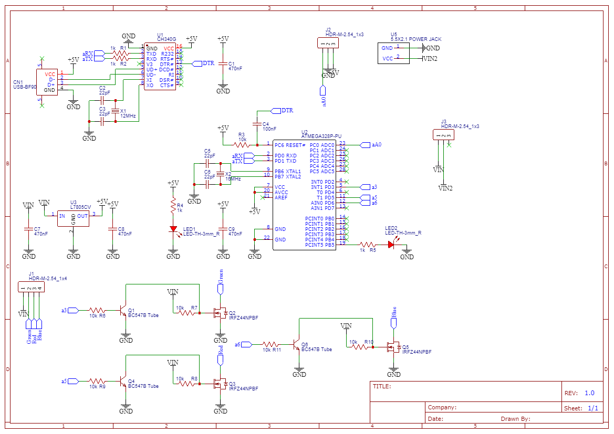

# Music Reactive Multicolor LED Lights
Music-reactive multi-color LED lights project. In this project, a simple 5050 RGB LED strip (not the Addressable LED WS2812), Arduino sound detection sensor and 12V adapter were used.  
So how does it work? If you take a closer look at the Arduino IDE source code of the project, an analog value comes from the Arduino sound sensor (this varies according to the intensity of the music), after that a threshold value is defined (just like 0 to 1023), if the value from the sound sensor does not match the threshold value, Arduino random () function is activated. 6 different color groups have been created in the random function, different color combinations can be created by changing the values in these color groups. If there is no analog value from the sound sensor, the function is stopped.   
This project can also be done with Arduino UNO R3 and some (IRFZ44N Transistor and similar) components, but I prepared this project on a single board. Easy solderable components were used (Just like DIP case Atmega348P). Of course, as always, I ordered the circuit board via PCBWay. You can order from the web address below and get this board.  
Get the Schematic and Gerber File (Also order):</b>  
https://www.pcbway.com/project/shareproject/Music_Reactive_Multicolor_LED_Lights_Board.html   
    
# Video Tutorial
  
# Schematic
    
# Required Components for PCB  
**Sound Detection Sensor -** https://bit.ly/2UBEm8z  
**LED Strip Light 5050 -** https://bit.ly/2AumaXt  
**AC DC 12V Adapter -** https://bit.ly/37wrVjC  
**DIP28 ATmega328P-PU -** https://bit.ly/30CJFII  
**IRFZ44N Transistor -** https://bit.ly/3hlgOOQ  
**L7805CV TO220 -** https://bit.ly/37ptKi4  
**Ceramic Capacitor -** https://bit.ly/30zXuaz  
**Electrolytic Capacitor -** https://bit.ly/30BaNYr  
**DIP IC Socket -** https://bit.ly/30ASdj7  
**Type B USB Socket -** https://bit.ly/2zwCYwE  
**2.1mm Jack Socket -** https://bit.ly/2UDhoxT  
**Toggle Switch -** https://bit.ly/2B4ADcs  
**LED -** https://bit.ly/2UFqnhR  
**Resistor -** https://bit.ly/2MUegJC  
**12MHz Crystal -** https://bit.ly/30NFWIr  
**16MHz Crystal -** https://bit.ly/2AmnaNv  
**Jumper Wire -** http://bit.ly/2J6de9E  
**Soldering Tools -** http://bit.ly/2PEiyVx   

**Banggood Summer Prime Sale -** https://bit.ly/3iMJX67  
**Banggood Summer Prime Brand Sale -** https://bit.ly/3eaJl6P  

**RD6006 Power Supply -** https://bit.ly/2ZV6vcv (<b>Coupon:BG6006</b>)  
**RD6012 Voltage Converter -** https://bit.ly/3ehA7pn (<b>Coupon: BG6012</b>)  
